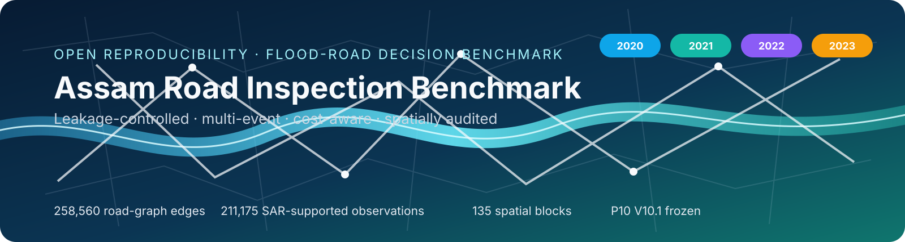
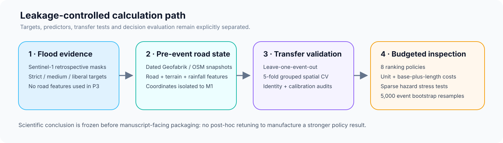
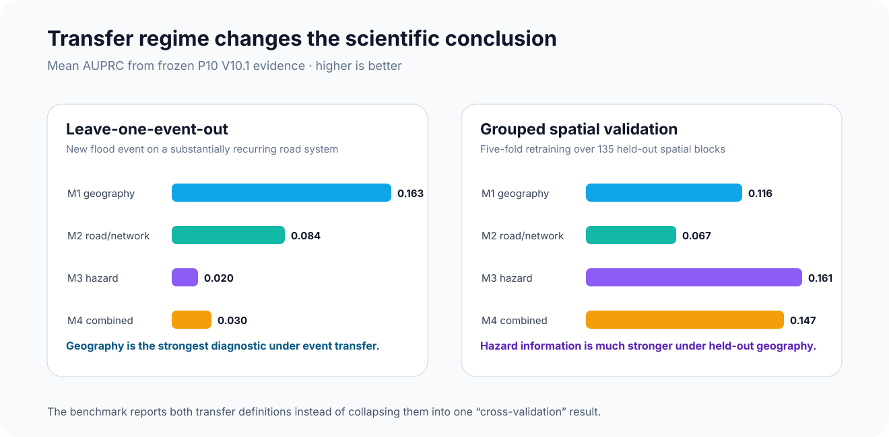
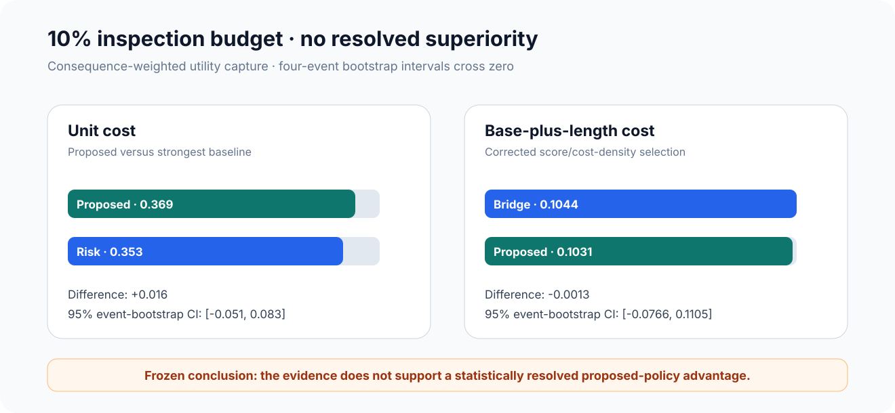

<p align="center">
  
</p>

<h1 align="center">Assam Road Inspection Benchmark</h1>

<p align="center">
  <strong>Reproducibility and calculation repository for a leakage-controlled, multi-event flood-road inspection benchmark in Assam, India</strong>
</p>

<p align="center">
  <a href="https://github.com/SunilgarGusai/Assam-Road-Inspection-Benchmark/actions/workflows/repository-validation.yml"></a>
  <a href="environment.yml"></a>
  <a href="results/frozen/P5_V10_event_summary.csv"></a>
  <a href="docs/FROZEN_RESULTS.md"></a>
  <a href="docs/RESULTS_FREEZE.md"></a>
  <a href="LICENSE"></a>
</p>

<p align="center">
  <a href="#study-at-a-glance">Study</a> •
  <a href="#key-evidence">Evidence</a> •
  <a href="#calculations">Calculations</a> •
  <a href="#reproducibility">Reproducibility</a> •
  <a href="#result-to-source-map">Result map</a> •
  <a href="#authors">Authors</a>
</p>

---

## Why this repository?

Flood-response decisions are not only about estimating where water is present. They also involve deciding **which road links should be inspected first when field capacity is limited**.

This repository exposes the frozen calculations, validation summaries, audit evidence, and lightweight verification tools for a four-event Assam benchmark. It is intentionally a **reproducibility repository**, not a manuscript mirror and not a dump of every development patch.

> **Central question:** How stable are road-inspection rankings across unseen flood events, held-out geography, alternative inspection costs, and sparse hazard observations?

The public package keeps the difficult findings visible:

- geography-only predictors are unexpectedly strong under leave-one-event-out transfer;
- hazard predictors become much stronger under grouped spatial validation;
- the proposed inspection score does **not** obtain statistically resolved superiority at the 10% budget;
- under base-plus-length cost, a simple bridge-first baseline is marginally stronger at 10%;
- risk and the chosen uncertainty transform collapse to the same ranking in the observed low-score regime;
- sparse hazard-observation experiments are non-monotonic and are treated as a stress test, not evidence that fewer observations are preferable.

## Study at a glance

| Evidence block | Frozen scope |
|---|---:|
| Assam flood events | **4** — 2020 monsoon, 2021 Aug, 2022 Jun, 2023 Jun |
| Event-specific road-graph edges | **258,560** |
| Valid SAR-supported edge-event observations | **211,175** |
| Primary positive edge-event observations | **2,487** |
| Predictor regimes | **4** — geography, road/network/environment, dynamic hazard, combined |
| Temporal validation | Leave-one-event-out across all four floods |
| Spatial validation | **5-fold grouped CV**, **135 spatial blocks** |
| Inspection policies | Random, rainfall, bridge, betweenness, consequence, risk, uncertainty, proposed |
| Budget levels | 1%, 2.5%, 5%, 10%, 15%, 20% |
| Cost models | Unit cost and corrected base-plus-length cost |
| Sparse hazard-observation levels | 10%, 30%, 50%, 70%, 90% |
| Sparse replicates | **20 per level** |
| Event-bootstrap resamples | **5,000** |

## Method at a glance

<p align="center">
  
</p>

The public calculation path separates:

1. **retrospective flood-exposure evidence** derived from event-specific Sentinel-1 masks;
2. **strictly pre-event road/network and environmental predictors**;
3. **transfer evaluation** across events and held-out spatial blocks;
4. **budgeted inspection evaluation** under two cost assumptions; and
5. **robustness audits** for sparse hazard observations, calibration, identity recurrence, and target sensitivity.

See [`docs/METHOD_PROTOCOL.md`](docs/METHOD_PROTOCOL.md) and [`docs/LEAKAGE_CONTROL.md`](docs/LEAKAGE_CONTROL.md).

## Key evidence

| Evidence | Frozen result | Interpretation |
|---|---:|---|
| LOEO geography-only mean AUPRC | **0.163** | Geography is a strong shortcut diagnostic across recurring event footprints |
| LOEO combined-model mean AUPRC | **0.030** | Dynamic/combined transfer to a wholly held-out flood event is weak |
| Spatial hazard-only mean AUPRC | **0.161** | Hazard information is much stronger under held-out geography than unseen-event transfer |
| Spatial combined mean AUROC | **0.898** | Strong spatial discrimination, but AUPRC remains the main rare-event metric |
| 10% unit-cost proposed utility | **0.369** | Numerically above risk, but not statistically resolved |
| 10% unit-cost risk utility | **0.353** | Strong simple comparator |
| 10% base-plus-length bridge utility | **0.104** | Slightly above proposed under corrected non-unit cost |
| 10% base-plus-length proposed utility | **0.103** | No resolved advantage over bridge-first |
| Mean LOEO OSM row-identity overlap | **69.5%** | LOEO is new-event transfer on a substantially recurring road system |
| Risk–uncertainty ranking equivalence | **4 / 4 events** | The uncertainty transform is not an independent ranking in this score range |

The four-event bootstrap intervals for the proposed-minus-best-baseline difference cross zero under both cost models. The repository therefore preserves the conclusion **without a superiority claim**.

### Transfer-regime snapshot

<p align="center">
  
</p>

### Decision-policy snapshot

<p align="center">
  
</p>

The visuals are generated directly from the committed frozen summary values and are intended for repository navigation, not as substitutes for the machine-readable evidence.

## Calculations

The principal equations and fixed design choices are documented in [`docs/CALCULATIONS.md`](docs/CALCULATIONS.md).

The public repository deliberately distinguishes:

- **frozen numerical evidence** from claims;
- **heuristic decision scores** from calibrated operational costs;
- **risk scores** from calibrated probabilities;
- **new-event transfer** from transfer to a wholly unseen road network; and
- **retrospective road exposure** from observed road closure or passability.

## Reproducibility

This repository is designed as an **auditable frozen-result package**.

### Quick validation

```bash
python -m pip install -r requirements.txt
python scripts/validate_frozen_package.py
python scripts/summarize_key_results.py
```

The validation script checks manuscript-facing invariants directly from the committed CSV/JSON evidence, including observation totals, positive counts, transfer metrics, 10% budget results, spatial-block counts, bootstrap conclusions, and the risk/uncertainty audit.

### Public reproducibility boundary

The repository does **not** pretend to provide byte-identical replay of the entire historical raw-data pipeline from a single command. Multi-gigabyte Sentinel-1, ERA5, CHIRPS, SRTM and dated Geofabrik/OSM source files are intentionally not redistributed here.

Instead, the public repository provides:

- frozen phase/event summaries;
- machine-readable model/validation/policy results;
- the final calculation and corrective-validation logic;
- data-source provenance;
- leakage-control documentation;
- independent P4 completeness evidence; and
- automated invariant checks.

See [`docs/REPRODUCIBILITY.md`](docs/REPRODUCIBILITY.md).

## Result-to-source map

| Evidence | Machine-readable source |
|---|---|
| Event/SAR support and target prevalence | [`P5_V10_event_summary.csv`](results/frozen/P5_V10_event_summary.csv) |
| Historical road-network scale | [`P4_V9_event_summary.csv`](results/frozen/P4_V9_event_summary.csv) |
| LOEO model metrics | [`P7_V10_leave_one_event_out_metrics.csv`](results/frozen/P7_V10_leave_one_event_out_metrics.csv) |
| True grouped-spatial metrics | [`P9_V10_1_true_spatial_group_validation.csv`](results/frozen/P9_V10_1_true_spatial_group_validation.csv) |
| Spatial summary | [`P10_V10_1_spatial_validation_summary.csv`](results/frozen/P10_V10_1_spatial_validation_summary.csv) |
| Inspection-policy curves | [`P10_V10_1_policy_summary.csv`](results/frozen/P10_V10_1_policy_summary.csv) |
| Sparse hazard-observation summary | [`P10_V10_1_sparse_summary_20reps.csv`](results/frozen/P10_V10_1_sparse_summary_20reps.csv) |
| OSM identity recurrence | [`P9_V10_1_osm_identity_overlap_audit.csv`](results/frozen/P9_V10_1_osm_identity_overlap_audit.csv) |
| Calibration / ranking audit | [`P9_V10_1_probability_calibration_audit.csv`](results/frozen/P9_V10_1_probability_calibration_audit.csv) |
| P10 statistical conclusion | [`P10_V10_1_STATISTICS.json`](results/frozen/P10_V10_1_STATISTICS.json) |
| Final claim gate | [`P10_V10_1_CLAIM_AUDIT.json`](results/frozen/P10_V10_1_CLAIM_AUDIT.json) |
| Independent 2020 road-completeness audit | [`P4_V9_5_3_2020_COMPLETENESS_AUDIT.json`](audits/P4_V9_5_3_2020_COMPLETENESS_AUDIT.json) |

## Repository structure

```text
.
├── .github/workflows/          # automated frozen-result validation
├── config/                     # frozen public study configuration
├── docs/
│   ├── assets/                 # repository banner + workflow visual
│   ├── CALCULATIONS.md         # formulas and decision-score definitions
│   ├── DATA_SOURCE_MANIFEST.md # public source provenance
│   ├── FROZEN_RESULTS.md       # reviewer-facing result inventory
│   ├── LEAKAGE_CONTROL.md      # predictor/target firewall
│   ├── METHOD_PROTOCOL.md      # public computational protocol
│   ├── REPRODUCIBILITY.md      # reproducibility boundary and verification
│   ├── RESULTS_FREEZE.md       # scientific freeze statement
│   └── CORRECTIVE_VALIDATION.md # V10.1 correction/audit rationale
├── results/frozen/             # machine-readable manuscript-supporting results
├── audits/                     # selected independent audit evidence
├── scripts/                    # validation and result-summary helpers
├── CITATION.cff
├── environment.yml
├── requirements.txt
└── REPOSITORY_MANIFEST.csv
```

## Scientific scope and limitations

This repository supports a **retrospective flood-road inspection benchmark**. It is not evidence of a field-deployed real-time road-closure system.

Important boundaries include:

- all four events are from Assam;
- Sentinel-1 road exposure is not an observed road-closure record;
- historical OSM snapshots predate events by 166–239 days;
- LOEO folds can contain road identities seen in training years;
- the network-consequence score is a transparent heuristic proxy, not traffic assignment or facility-access simulation;
- the base-plus-length inspection cost is a benchmark proxy, not a measured agency cost model;
- only four independent flood events support the event-level uncertainty analysis;
- sparse hazard-observation masking is a robustness stress test, not evidence that fewer observations are operationally desirable.

## Public data policy

Raw external datasets are **not redistributed**. Source providers retain their own terms.

The repository documents how the study used:

- Sentinel-1 GRD;
- ERA5 hourly total precipitation;
- CHIRPS daily rainfall;
- SRTM terrain;
- dated Geofabrik OpenStreetMap extracts.

See [`docs/DATA_SOURCE_MANIFEST.md`](docs/DATA_SOURCE_MANIFEST.md) and [`THIRD_PARTY_LICENSES.md`](THIRD_PARTY_LICENSES.md).

## Authors

- **Sunilgar L. Gusai** — corresponding author, Faculty of Computer Applications, Marwadi University  
  ORCID: [0009-0004-0739-4812](https://orcid.org/0009-0004-0739-4812)
- **Manoharsinh R. Jadeja** — Department of Artificial Intelligence, Machine Learning and Data Science, Marwadi University  
  ORCID: [0000-0003-1833-4730](https://orcid.org/0000-0003-1833-4730)

## Citation

Citation metadata are provided in [`CITATION.cff`](CITATION.cff). Until publication metadata are available, cite the repository by title, authors, URL, and commit.

## License

Original repository code and documentation are released under the **MIT License**. External datasets and third-party materials are not relicensed. See [`THIRD_PARTY_LICENSES.md`](THIRD_PARTY_LICENSES.md).
